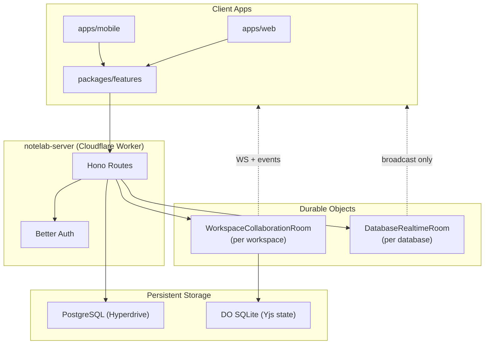
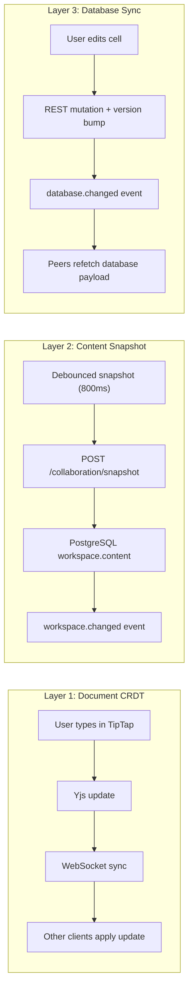
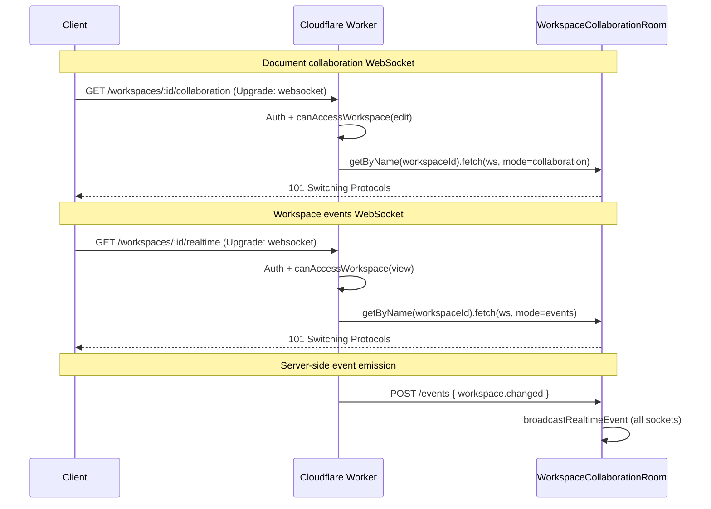
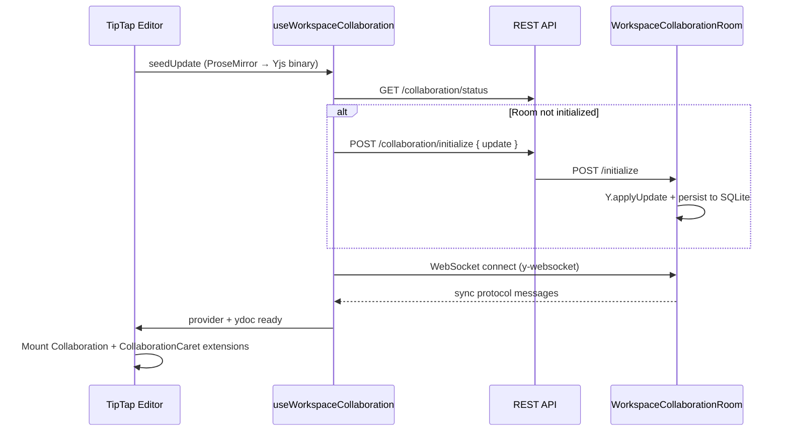
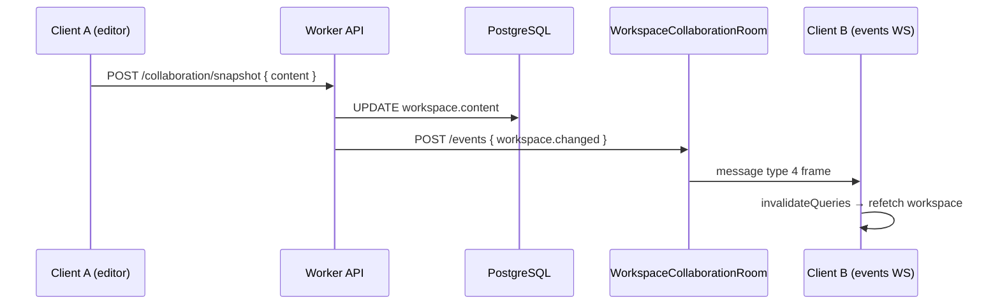
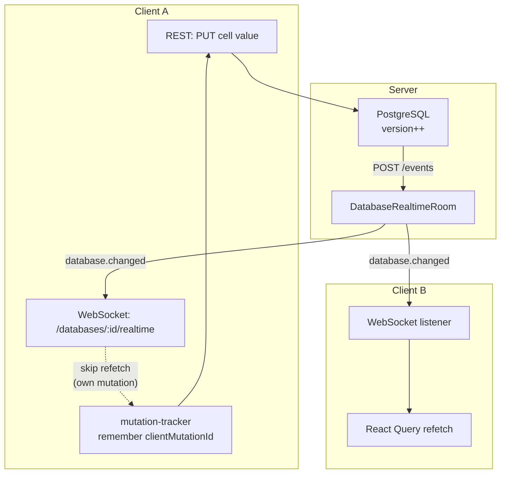
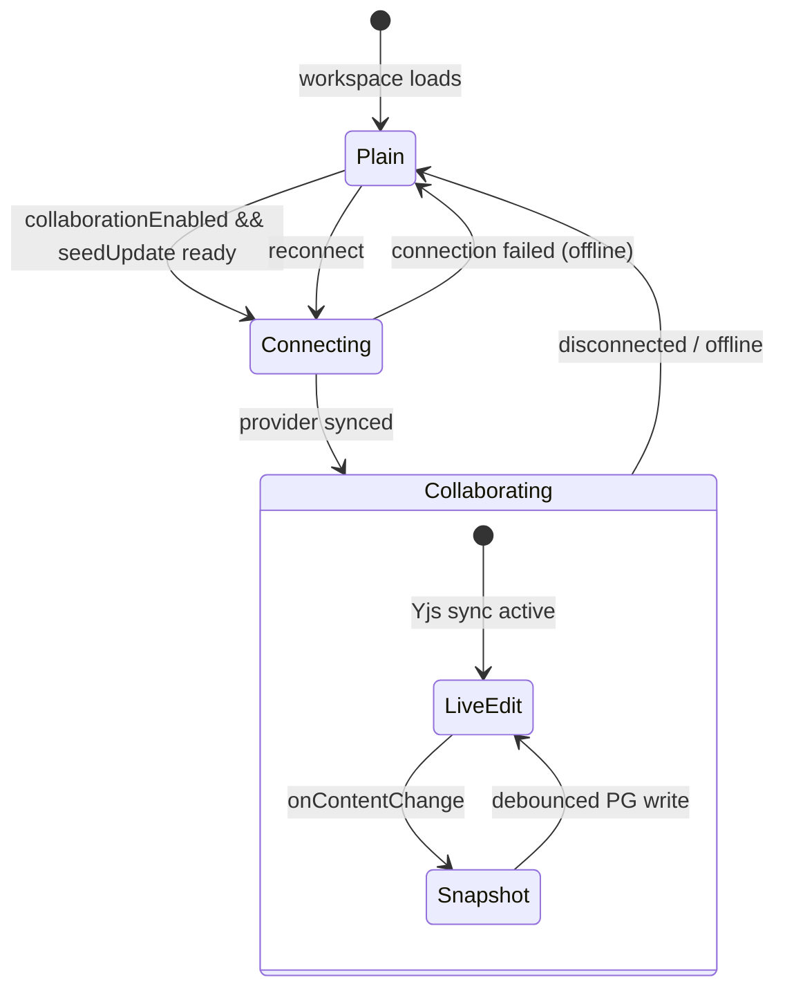

# Architecture of Collaboration

This document describes how Notelab enables real-time collaboration across workspaces, rich-text documents, databases, and comments. The system is built on **Cloudflare Durable Objects**, **Yjs CRDTs**, and a **React Query–driven invalidation model** on the client.

---

## Table of Contents

1. [Overview](#overview)
2. [High-Level Architecture](#high-level-architecture)
3. [Collaboration Layers](#collaboration-layers)
4. [Server Infrastructure](#server-infrastructure)
5. [Durable Object Migrations](#durable-object-migrations)
6. [Document Collaboration (CRDT)](#document-collaboration-crdt)
7. [Workspace Realtime Events](#workspace-realtime-events)
8. [Database Realtime & Presence](#database-realtime--presence)
9. [Comments Realtime](#comments-realtime)
10. [Client Architecture](#client-architecture)
11. [Access Control](#access-control)
12. [Persistence & Durability](#persistence--durability)
13. [Message Protocols](#message-protocols)
14. [Reconnection & Failure Handling](#reconnection--failure-handling)
15. [Key Files Reference](#key-files-reference)

---

## Overview

Notelab collaboration spans three distinct concerns, each with its own transport and consistency model:

| Layer | Purpose | Technology | Consistency |
|-------|---------|------------|-------------|
| **Document editing** | Live co-editing of workspace page content (TipTap/ProseMirror) | Yjs + y-protocols over WebSocket | Strong eventual (CRDT merge) |
| **Workspace events** | Propagate metadata, name, and content snapshot changes to other clients | JSON events over WebSocket | Eventual (refetch on event) |
| **Database realtime** | Sync database mutations and show cell-level presence | JSON events + presence over WebSocket | Eventual (versioned refetch) |

Collaboration uses **two Durable Object classes**:

- **`WorkspaceCollaborationRoom`** (per workspace) — hosts Yjs document sync, awareness, and workspace/comment event broadcast. Clients open **two WebSocket connections** to the same room in different modes: `collaboration` (binary Yjs) and `events` (workspace/comment notifications).
- **`DatabaseRealtimeRoom`** (per database) — broadcasts database mutation events and cell-level presence.

> **Note:** An earlier standalone `WorkspaceRealtimeRoom` DO existed briefly but has been removed. Workspace events now flow entirely through `WorkspaceCollaborationRoom`. See [Durable Object Migrations](#durable-object-migrations).



---

## High-Level Architecture

### Monorepo Layout

```
notelab/
├── apps/
│   ├── web/          # Vite web client — TipTap editor, collaboration hooks
│   └── mobile/       # Mobile client (consumes packages/features)
├── packages/
│   └── features/     # Shared hooks: useWorkspaceRealtime, useDatabaseRealtime
└── docs/             # This document

notelab-server/
└── src/
    └── collaboration/
        ├── workspace-collaboration-room.ts
        ├── database-realtime-room.ts
        └── workspace-realtime-events.ts
```

### Design Principles

1. **Separation of live editing vs. authoritative state** — Yjs handles live document merges; PostgreSQL remains the source of truth via debounced content snapshots.
2. **One room per resource** — Each workspace gets one `WorkspaceCollaborationRoom`; each database gets one `DatabaseRealtimeRoom`. Rooms are addressed by `getByName(resourceId)`.
3. **Push notifications, pull data** — Realtime channels deliver *events*; clients invalidate React Query caches and refetch authoritative payloads.
4. **Optimistic mutation deduplication** — Database mutations carry `clientMutationId` so the originating client skips redundant refetches.
5. **Two storage tiers** — PostgreSQL (relational data) and Durable Object SQLite (ephemeral Yjs state) are independent. Resetting the Postgres database does not clear DO state or Cloudflare migration history.

---

## Collaboration Layers



### What each layer handles

| Concern | Layer | Real-time? | Persisted where |
|---------|-------|------------|-----------------|
| Character-by-character editing | Document CRDT | Yes (Yjs) | DO SQLite + snapshot → PG |
| Workspace name / emoji / metadata | Workspace events | Yes (event) | PostgreSQL |
| Database rows, properties, values | Database events | Yes (event) | PostgreSQL |
| Who is editing which cell | Database presence | Yes (ephemeral) | In-memory (DO) |
| Comment threads & reactions | Comments events | Yes (event) | PostgreSQL |
| Caret & selection in document | Yjs awareness | Yes (ephemeral) | In-memory (DO) |

---

## Server Infrastructure

### Durable Object Bindings

Configured in `notelab-server/wrangler.jsonc`:

| Binding | Class | Scope | Role |
|---------|-------|-------|------|
| `WORKSPACE_COLLABORATION` | `WorkspaceCollaborationRoom` | 1 per workspace ID | Yjs doc sync, awareness, workspace/comment events |
| `DATABASE_REALTIME` | `DatabaseRealtimeRoom` | 1 per database ID | Database change broadcast, cell presence |

`CHAT_AGENT` is also bound in `wrangler.jsonc` but is unrelated to collaboration.

### WorkspaceCollaborationRoom Socket Modes

The same Durable Object instance handles both editing and event subscriptions. Mode is set via the `x-notelab-ws-mode` header:

| Mode | Header value | WebSocket route | Client hook | Behavior |
|------|-------------|-----------------|-------------|----------|
| Collaboration | `collaboration` | `GET /workspaces/:id/collaboration` | `useWorkspaceCollaboration` | Binary Yjs sync + awareness |
| Events | `events` | `GET /workspaces/:id/realtime` | `useWorkspaceRealtime` | Receives message type `4` event frames; does not participate in Yjs sync |

Collaboration-mode sockets process sync/awareness messages. Events-mode sockets are receive-only for workspace and comment notifications.

### HTTP → Durable Object Routing



### REST Endpoints

| Method | Path | Access | Purpose |
|--------|------|--------|---------|
| `GET` | `/workspaces/:id/collaboration/status` | view | Check if Yjs room is initialized |
| `POST` | `/workspaces/:id/collaboration/initialize` | edit | Seed Yjs document from client content |
| `POST` | `/workspaces/:id/collaboration/reinitialize` | edit | Wipe and re-seed Yjs document |
| `POST` | `/workspaces/:id/collaboration/snapshot` | edit | Persist editor JSON to PostgreSQL |
| `GET` | `/workspaces/:id/collaboration` | edit | WebSocket upgrade (collaboration mode) |
| `GET` | `/workspaces/:id/realtime` | view | WebSocket upgrade (events mode) |
| `GET` | `/databases/:id/realtime` | view | WebSocket upgrade (database events + presence) |

Server-side mutations emit events to the Durable Object via internal `POST /events` requests (not exposed to clients).

---

## Durable Object Migrations

Cloudflare Durable Object migrations are **separate from PostgreSQL migrations**. They track which DO classes exist in Cloudflare's infrastructure and cannot be removed from history once applied.

### Current migration chain

| Tag | Action | Class |
|-----|--------|-------|
| v1 | `new_sqlite_classes` | `WorkspaceCollaborationRoom` |
| v2 | `new_sqlite_classes` | `DatabaseRealtimeRoom` |
| v3 | `new_sqlite_classes` | `WorkspaceRealtimeRoom` *(removed in v5)* |
| v4 | `new_sqlite_classes` | `ChatAgent` |
| v5 | `deleted_classes` | `WorkspaceRealtimeRoom` |

### Removed: WorkspaceRealtimeRoom

An early version of the system used a standalone `WorkspaceRealtimeRoom` Durable Object — one DO per workspace dedicated only to broadcasting `workspace.changed` and `comments.changed` events.

This was consolidated into `WorkspaceCollaborationRoom`, which now handles both Yjs collaboration and event broadcast. The legacy class has been:

- **Removed from code** — `workspace-realtime-room.ts` deleted; no `WORKSPACE_REALTIME` binding
- **Retired in Cloudflare** — v5 `deleted_classes` migration removes deployed instances

v3 remains in `wrangler.jsonc` because Cloudflare migration history is append-only. v5 must be deployed once on any environment where v3 was previously applied.

### Postgres reset vs DO state

| Reset action | What it clears |
|---|---|
| `npm run db:reset` (Drizzle) | PostgreSQL tables — users, workspaces, databases, comments |
| Deploy v5 migration | Cloudflare DO registry entry for `WorkspaceRealtimeRoom` |
| DO instance eviction | Yjs document state stored in a workspace's `WorkspaceCollaborationRoom` SQLite |

Resetting Postgres does **not** clear Yjs state inside live Durable Object instances. To fully reset collaboration state for a workspace, use `POST /collaboration/reinitialize` or wait for DO instances to be evicted.

---

## Document Collaboration (CRDT)

### Stack

- **Editor**: TipTap (ProseMirror)
- **CRDT**: [Yjs](https://github.com/yjs/yjs)
- **Sync protocol**: `y-protocols/sync` (message type `0`)
- **Awareness protocol**: `y-protocols/awareness` (message types `1`, `3`)
- **Client provider**: `y-websocket` (`WebsocketProvider`)
- **TipTap extensions**: `@tiptap/extension-collaboration`, `@tiptap/extension-collaboration-caret`

### Connection Lifecycle



### Room Initialization

When a workspace has never been collaboratively edited:

1. Client converts current ProseMirror content to a Yjs update via `createCollaborationSeedUpdate`.
2. Client calls `POST /workspaces/:id/collaboration/initialize` with a base64-encoded update.
3. `WorkspaceCollaborationRoom` applies the update only if no document exists (`hasDocument === false`).
4. The room persists the full Yjs state to its SQLite table.

If initialization is skipped because another client already initialized, the joining client simply connects and receives the existing state via sync.

### Awareness (Presence in Documents)

Each connected editor client publishes awareness state:

```typescript
{
  user: {
    id: string
    name: string
    email?: string
    image?: string | null
    color: string   // stable hash-based color
  }
}
```

The server tracks awareness client IDs per WebSocket attachment. On disconnect, awareness states are removed and broadcast to remaining peers.

**UI rendering**: `CollaborationCaret` renders a colored caret with the collaborator's name; selections are highlighted with a translucent version of their color.

### Content Snapshot (Authoritative Persistence)

Live Yjs state in the Durable Object is **not** the long-term source of truth. Instead:

1. When collaboration is ready, `onContentChange` routes to `useWorkspaceContentSnapshot` instead of direct REST saves.
2. Snapshots are debounced at **800ms**.
3. `POST /workspaces/:id/collaboration/snapshot` writes `workspace.content` to PostgreSQL.
4. A `workspace.changed` event is emitted so other clients refetch.

Snapshots also flush on `beforeunload` and when the tab becomes hidden.

### Undo/Redo Behavior

When collaboration is enabled, TipTap's built-in `undoRedo` extension is **disabled** (`undoRedo: false`). Undo history is managed by the Yjs document instead.

---

## Workspace Realtime Events

Workspace-level changes that are not handled by the CRDT (metadata, name, content from snapshots) are broadcast as typed JSON events.

### Event Types

```typescript
// workspace-realtime-events.ts

type WorkspaceChangedEvent = {
  type: "workspace.changed"
  workspaceId: string
  organizationId: string
  actorId: string
  mutationId: string
  committedAt: string
  changed: ("metadata" | "name" | "content")[]
}

type WorkspaceCommentsChangedEvent = {
  type: "comments.changed"
  workspaceId: string
  organizationId: string
  threadId: string
  actorId: string
  mutationId: string
  committedAt: string
  changed: WorkspaceCommentsChangedKind[]
}
```

### Emission Points

| Trigger | Event | Emitter |
|---------|-------|---------|
| Workspace update (name, metadata, content) | `workspace.changed` | `workspaces.ts` routes |
| Content snapshot save | `workspace.changed` (changed: `["content"]`) | `collaboration/snapshot` route |
| Comment create/update/delete | `comments.changed` | `comments.ts` routes |
| Reaction add/remove | `comments.changed` | `comments.ts` routes |
| Thread resolve/unresolve | `comments.changed` | `comments.ts` routes |

### Client Handling

`useWorkspaceRealtime` subscribes via `GET /workspaces/:id/realtime` and delegates to `createWorkspaceRealtimeSubscription`:

- `workspace.changed` → invalidates workspace query, workspaces list, and database queries (debounced 120ms).
- `comments.changed` → invalidates comment and thread queries for the workspace.

### Event Transport

When a workspace or comment mutation commits in PostgreSQL, the API emits an event to the workspace's `WorkspaceCollaborationRoom` via `POST /events`. The room wraps the JSON payload in a **message type `4`** binary frame and broadcasts it to **all** connected sockets (both collaboration and events modes).

Clients on the events WebSocket (`useWorkspaceRealtime`) decode incoming frames with `parseWorkspaceRealtimeFrame` and route them through `createWorkspaceRealtimeSubscription` to invalidate React Query caches.



---

## Database Realtime & Presence

Database collaboration does **not** use CRDTs. Instead, it combines **versioned change events** with **ephemeral presence**.

### Architecture



### Change Events

Every database mutation runs inside a transaction that increments `database.version`:

```typescript
type DatabaseChangedEvent = {
  type: "database.changed"
  databaseId: string
  version: number
  mutationId: string
  clientMutationId?: string
  actorId: string
  changed: ("database" | "views" | "properties" | "rows" | "values")[]
  committedAt: string
}
```

### Refetch Decision Logic

`getDatabaseChangedRefetchDecision` determines whether a client should refetch:

1. If `event.version <= localVersion` → skip (already up to date).
2. If `clientMutationId` matches a recently local mutation (within 15s) → skip (own change).
3. Otherwise → schedule debounced refetch (120ms).

On refetch, the client invalidates:
- The database query (`databaseQueryKey`)
- All workspace queries for row pages
- The generic `["workspace"]` query key

### Cell Presence

Presence is **ephemeral** and stored only in the Durable Object's WebSocket attachments.

```typescript
type DatabasePresence = {
  activeRowId?: string | null
  activePropertyId?: string | null
  activeViewId?: string | null
}
```

#### Presence Protocol

| Message | Direction | Purpose |
|---------|-----------|---------|
| `hello` | Client → Server | Join room, optionally report `lastSeenVersion` |
| `realtime.ready` | Server → Client | Confirm connection, send current peers |
| `presence.update` | Bidirectional | Broadcast active cell/view |
| `presence.clear` | Server → Clients | Remove collaborator on disconnect |
| `database.changed` | Server → Clients | Trigger refetch |

#### Client Presence Behavior

- Heartbeat every **20 seconds** (`presenceHeartbeatMs`).
- Stale presence pruned after **45 seconds** (`stalePresenceMs`).
- Colors assigned deterministically from `user.id` via `addCollaboratorColor`.
- Cell presence keyed as `rowId:propertyId` for UI overlays.

#### UI

`database-table-view.tsx` renders up to 3 collaborator avatars on cells with active presence, using CSS variable `--database-presence-color`.

---

## Comments Realtime

Comments use the same workspace event channel as metadata changes. All comment mutations emit `comments.changed` with a specific `changed` kind:

| Kind | Action |
|------|--------|
| `message.created` | New comment |
| `message.updated` | Edit comment |
| `message.deleted` | Delete comment |
| `reaction.created` | Add emoji reaction |
| `reaction.deleted` | Remove reaction |
| `thread.resolved` | Resolve thread |
| `thread.unresolved` | Reopen thread |

Events are routed through `WorkspaceCollaborationRoom`.

---

## Client Architecture

### Hook Map

| Hook | Package | Used by | Purpose |
|------|---------|---------|---------|
| `useWorkspaceCollaboration` | `apps/web` | `editor.tsx` | Yjs provider, awareness, connection lifecycle |
| `useWorkspaceContentSnapshot` | `apps/web` | `workspace.tsx` | Debounced PG persistence during collaboration |
| `useWorkspaceRealtime` | `packages/features` | `workspace.tsx` | Subscribe to workspace + comment events |
| `useDatabaseRealtime` | `packages/features` | `use-database-view-controller.tsx` | Database events + cell presence |

### Editor Integration Flow



### Workspace Page Wiring (`workspace.tsx`)

```
useWorkspaceRealtime(workspaceId)     → keep metadata/name/comments in sync
useWorkspaceContentSnapshot()         → persist CRDT state to PG (when collaborationReady)
Editor
  └── useWorkspaceCollaboration()     → Yjs live editing
  └── onCollaborationReadyChange      → gates snapshot saving
```

### Database View Wiring (`use-database-view-controller.tsx`)

```
useDatabaseRealtime(databaseId, {
  activeRowId,       → derived from focused cell
  activePropertyId,
  activeViewId,
  localVersion,      → from cached payload
})
  → cellPresenceByKey → passed to DatabaseViewContext
  → realtimeStatus    → connection indicator
```

---

## Access Control

All collaboration endpoints enforce workspace-level permissions via `canAccessWorkspace`:

| Endpoint | Minimum access |
|----------|----------------|
| `GET /workspaces/:id/collaboration` (WebSocket) | `edit` |
| `POST /workspaces/:id/collaboration/initialize` | `edit` |
| `POST /workspaces/:id/collaboration/reinitialize` | `edit` |
| `POST /workspaces/:id/collaboration/snapshot` | `edit` |
| `GET /workspaces/:id/collaboration/status` | `view` |
| `GET /workspaces/:id/realtime` (WebSocket) | `view` |
| `GET /databases/:id/realtime` (WebSocket) | `view` |

Access levels are resolved through organization membership, team rules, and per-workspace grants (`workspaceAccess` table). The editor itself checks `accessLevel === "edit" || accessLevel === "full"` before enabling collaboration.

---

## Persistence & Durability

### Yjs Document (Durable Object SQLite)

```sql
CREATE TABLE y_documents (
  key TEXT PRIMARY KEY,          -- always "workspace"
  update_base64 TEXT NOT NULL,   -- Y.encodeStateAsUpdate(doc)
  updated_at INTEGER NOT NULL
)
```

- Persisted on every Yjs update, debounced at **2 seconds** (`persistDebounceMs`).
- Loaded on Durable Object construction via `blockConcurrencyWhile`.
- `reinitialize` wipes the table and applies a fresh seed update.

### PostgreSQL (Authoritative)

| Table | Collaboration role |
|-------|-------------------|
| `workspace` | `content` (JSON), `name`, `metadata`, `updatedAt` |
| `database` | `version` counter for change events |
| `comment_thread`, `comment_message`, `comment_reaction` | Comment data |

### Data Flow: Edit → Persist

```
User keystroke
  → Yjs local update
  → WebSocket → DO → broadcast to peers
  → DO SQLite (debounced 2s)
  → Client onContentChange
  → useWorkspaceContentSnapshot (debounced 800ms)
  → POST /collaboration/snapshot
  → PostgreSQL workspace.content
  → workspace.changed event → peers refetch
```

---

## Message Protocols

### Yjs Binary Protocol (WorkspaceCollaborationRoom)

| Type | Value | Description |
|------|-------|-------------|
| `messageSync` | `0` | y-protocols sync (document updates) |
| `messageAwareness` | `1` | Awareness state broadcast |
| `messageQueryAwareness` | `3` | Request current awareness states |
| `messageRealtime` | `4` | Workspace/comment JSON events |

### Database JSON Protocol (DatabaseRealtimeRoom)

All messages are JSON strings over WebSocket.

```typescript
// Client → Server
{ type: "hello", lastSeenVersion?: number }
{ type: "presence.update", databaseId, activeRowId?, activePropertyId?, activeViewId? }

// Server → Client
{ type: "realtime.ready", databaseId, sessionId, peers, lastSeenVersion? }
{ type: "database.changed", ...DatabaseChangedEvent }
{ type: "presence.update", databaseId, collaborator }
{ type: "presence.clear", databaseId, sessionId }
```

### Workspace Events Binary Protocol

Events are JSON objects wrapped in message type `4` frames (via `lib0/encoding`). The client codec in `realtime-utils.ts` provides:

- `encodeWorkspaceRealtimeFrame` — wraps an event for testing
- `parseWorkspaceRealtimeFrame` — decodes incoming binary frames from the events WebSocket

Event payload schema (inside the frame):

```typescript
type WorkspaceRealtimeEvent =
  | WorkspaceChangedEvent
  | WorkspaceCommentsChangedEvent
```

---

## Reconnection & Failure Handling

### Document Collaboration

| Scenario | Behavior |
|----------|----------|
| Connection fails during setup | Provider destroyed; editor falls back to plain mode |
| Disconnected mid-session | Editor remains editable (`status === "disconnected"`) |
| Offline | Editor remains editable; no live sync |
| Reconnect | y-websocket handles resync automatically |

### Workspace Realtime

- Exponential backoff reconnect: `min(10s, 500ms × 2^attempt)`.
- On reconnect after prior disconnect → `scheduleReconnectRefetch()` invalidates workspace and comment caches.

### Database Realtime

- Same exponential backoff as workspace realtime.
- On connect/reconnect with `lastSeenVersion === null` or after reconnect → schedule refetch.
- `hello` message reports `lastSeenVersion` for server-side awareness (logged in ready response).

### Mutation Tracker

`mutation-tracker.ts` maintains a 15-second window of `clientMutationId` values to prevent refetch loops from the client's own database writes.

---

## Key Files Reference

### Server (`notelab-server`)

| File | Role |
|------|------|
| `src/collaboration/workspace-collaboration-room.ts` | Yjs sync, awareness, event broadcast, SQLite persistence |
| `src/collaboration/database-realtime-room.ts` | Database events, cell presence |
| `src/collaboration/workspace-realtime-events.ts` | Event type definitions |
| `src/routes/workspaces.ts` | Collaboration REST + WebSocket routes, event emission |
| `src/routes/databases.ts` | Database mutations with version bump, realtime WebSocket |
| `src/routes/comments.ts` | Comment mutations with event emission |
| `wrangler.jsonc` | Durable Object bindings and migration chain (v1–v5) |

### Client (`notelab`)

| File | Role |
|------|------|
| `apps/web/src/editor/use-workspace-collaboration.ts` | Yjs WebSocket provider lifecycle |
| `apps/web/src/editor/use-workspace-content-snapshot.ts` | Debounced PG snapshot persistence |
| `apps/web/src/editor/editor.tsx` | TipTap + Collaboration extensions, caret rendering |
| `apps/web/src/pages/workspace.tsx` | Orchestrates realtime + snapshot + editor |
| `packages/features/src/workspaces/realtime.ts` | Events WebSocket hook (`/realtime`) |
| `packages/features/src/workspaces/realtime-utils.ts` | URL builder, frame codec, event parsers |
| `packages/features/src/workspaces/realtime-subscription.ts` | Event → query invalidation |
| `packages/features/src/databases/realtime.ts` | Database event + presence hook |
| `packages/features/src/databases/realtime-utils.ts` | URL builders, refetch logic, presence helpers |
| `packages/features/src/databases/mutation-tracker.ts` | Client mutation deduplication |

---

## Summary

Notelab's collaboration architecture uses a **hybrid model** with **two active Durable Object classes**:

| Durable Object | Handles |
|---|---|
| `WorkspaceCollaborationRoom` | Live document editing (Yjs), caret awareness, workspace/comment events |
| `DatabaseRealtimeRoom` | Database mutation broadcast, cell presence |

Core patterns:

- **CRDTs (Yjs)** for conflict-free, character-level document editing with live cursors.
- **Event-driven invalidation** for everything else (databases, comments, workspace metadata).
- **Cloudflare Durable Objects** as per-resource coordination points with SQLite-backed Yjs persistence.
- **PostgreSQL** as the authoritative relational store, fed by debounced content snapshots.
- **Two WebSockets per workspace** — one for editing (`/collaboration`), one for metadata/comment sync (`/realtime`) — both routed to the same `WorkspaceCollaborationRoom` instance in different modes.

The legacy `WorkspaceRealtimeRoom` has been fully removed from code. Deploy the v5 `deleted_classes` migration to retire it from Cloudflare infrastructure on environments where v3 was previously applied.